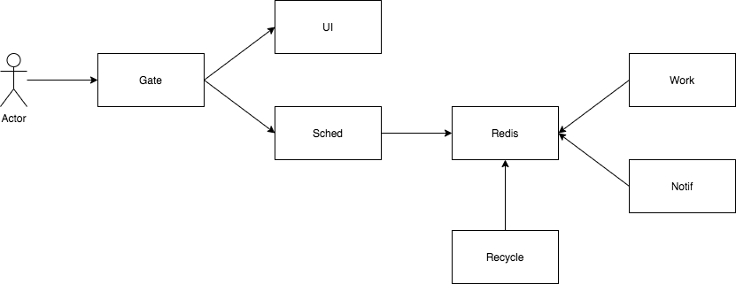

# Architecture

## Terminology
- **worker**: A worker is a service consuming items and processing them in background. It is not accessible from the outer API. Chainr **work** and **notif** are workers.
